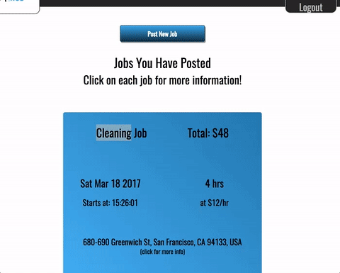

YouthWorkHub

# YouthWorkHub

[YouthWorkHub Live][heroku]

[heroku]: https://youth-work-hub.herokuapp.com/#/

YouthWorkHub is a full-stack web application inspired by TaskRabbit. It
provides a platform for people to find young people to help with domestic
work types of odd jobs. This web application uses Ruby on Rails with
Postgres for its backend, and React/Redux for its front end.

YouthWorkHub is a practice coding project by Torah Oglander.

## Features

- Secure Signup and Login for two different types of users: Employers and workers
- Index and Show views of all worker profiles are available to any visitor to the site
- Profile pictures can be uploaded and appear in the login dialogue once logged in. Profile pictures also appear on the worker's profile
- All forms appear in 'modal' overlays that demand user focus
- pop-up menus for login/signup/logout are implemented in pure CSS

### Employer Features
- Employers can post jobs. Newly posted jobs start with a status of 'pending'
- Google Maps API reverse-geolocation is used to suggest addresses and drop
pins in the correct location on the form where Employers can post jobs

### Worker Features
- Workers have a drop-down 'my-jobs' link in the navigation to view jobs they have accepted
- Workers can view jobs, and an accept button allows them to 'take' the job
- Google Maps API is used for geolocation to place posted Jobs on the map
and enable searching for jobs by location

## Project Design

Youth Work Hub was conceived of, designed and built in less than three weeks

A [proposal][proposal] was drafted to help provide an implementation timeline during the development process.

A [database schema][schema] was prepared alongside the design proposal.

## Technology

Youth Work Hub was built on Rails and React.js. Data on the frontend is
managed with Redux so that all current data lives in a single, actively-managed
'store'. NPM is the frontend package manager, used along with webpack to
transpile ES6 into more widely supported ES5
for better javascript support.

### Backend

- Youth Work Hub depends on a Postres database
- The live demo version of the site is hosted on heroku
- Version control is managed on Github
- Data is handed off to the frontend as JSON objects via the Jbuilder Ruby Gem
- Cloudinary is used to handle photo storage

### Frontend
- All frontend views are React elements
- Redux manages the frontend data
- 'react-modal' is used to implement the modal forms
- Google Maps API is used to locate jobs on a map and enable search-by-location
- Cloudinary is used to manage profile pictures in the app

## Future Implementations

Youth Work Hub is a work in progress. It has been a great learning experience,
but obviously a lot is left to do.

The following features will be added in the near future:
- Worker's show page will show a list of reviews left for their work, and their average ratings
- Workers and Employers will be able to leave comments on jobs
